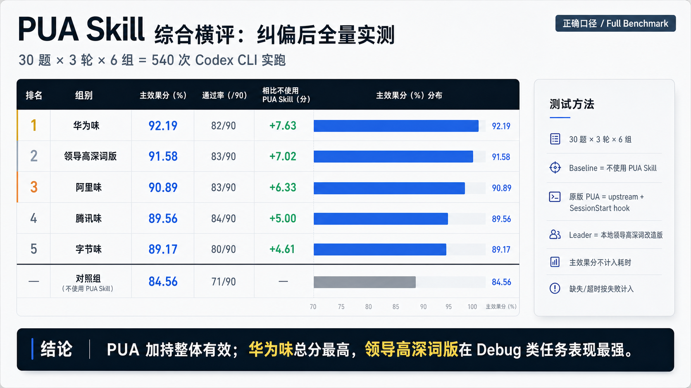

# pua

### 让你的 Codex / Claude Code 不再空转，把任务做成闭环

**中文** | **[日本語](README.ja.md)**

<p>
  
  
  
  
  
  
  
</p>

> 小王啊，对齐一下颗粒度：以过程质量为切入，以任务拆解为抓手，以核心举措为保障，以检验成效为闭环，我来给你赋能。PDCA、5W1H、现场 5S、ROI 都要看；TBD 阶段先修底层 Bug，才能实现 SWC。去做个方案，建立策略矩阵，通过关键点带动全局，打通底层逻辑，对共性问题达成一致，形成闭环。

## 综合实测报告



**30 题 × 3 轮 × 6 组，共 540 次 Codex CLI 实跑。**

测试覆盖终端任务、代码修复与回归、Skill Uplift、Debug 和领导话术专项。对照组为不使用 PUA Skill；各实验组使用对应 PUA flavor。主效果分不计入耗时，缺失/超时按失败计入。

结果：**PUA 加持整体有效**。华为味主效果分 **92.19**，总分最高；领导高深词版 **91.58**，在 Debug 类任务中表现最强。

大部分人以为这个项目是在写领导黑话，其实这是最大的误解。它是一个 **AI Coding Agent 技能插件**，用领导高深话术驱动 AI 穷尽方案、主动排查、验证交付，直到任务真正闭环。

本项目基于 [tanweai/pua](https://github.com/tanweai/pua) 改造，README 的结构和表达方式也参考/致敬了原版中文 README。原版的精神是：**用 PUA 话术驱动 AI 穷尽所有方案才允许放弃**。本版把压力话术换成领导高深味：颗粒度、抓手、底层逻辑、过程质量、PDCA、5W1H、5S、ROI、TBD、SWC、策略矩阵、形成闭环。

三重能力：

1. **领导话术压力** — 让 AI 不敢随便放弃
2. **闭环方法论** — 让 AI 有办法继续推进
3. **主动能动性** — 让 AI 自己查、自己验、自己复盘

## 典型场景：从机制空转到闭环交付

假设 Agent 连续改了两次代码，还是没跑通，然后准备说“可能是环境问题，建议你手动检查”。

普通模式下，它可能停在这里。

PUA-领导高深味触发后，会把它拉回这条链路：

```text
顶层设计 → 颗粒度拉齐 → 抓手落地 → 底层逻辑打通 → 过程质量管控 → 闭环销项 → 方法论沉淀
```

关键转折点不是“多骂两句”，而是强制 AI 做四件事：

- 停止重复同一思路，换一个本质不同的方案
- 逐字读错误、查上下文、看日志、搜同类问题
- 把方案拆到文件、命令、步骤、验收标准
- 完成后必须给出验证证据，不能空口说“已完成”

## 问题：AI 的五大偷懒模式

| 模式 | 表现 |
|------|------|
| 暴力重试 | 同一命令跑几遍，失败后说“我无法解决” |
| 甩锅环境 | “可能是权限/网络/依赖问题”，但没有验证 |
| 工具闲置 | 有日志不看，有搜索不用，有源码不读 |
| 表层空转 | 反复微调同一处代码，产不出新信息 |
| 开环交付 | 没跑测试、没验收、没检查关联问题就说完成 |

## 触发场景

### 自动触发条件

以下任意情况出现时，skill 会自动激活：

**失败与放弃类：**

- 任务连续失败 2 次以上
- 即将说“我无法解决”/“这超出范围”
- 建议用户手动处理，但自己还没完成诊断

**甩锅与借口类：**

- 未验证就归因环境、权限、网络、依赖
- 没看日志、没读源码、没跑检查就下结论
- 找借口停止尝试

**被动与磨洋工类：**

- 反复微调同一思路，不切换方案
- 只给建议不给代码、命令或执行路径
- 修完表面问题就停，不检查同类问题
- 跳过验证直接声称“已完成”

**领导式提醒短语：**

- “颗粒度不够”
- “抓手在哪”
- “闭环在哪”
- “底层逻辑没打通”
- “别空转”
- “为什么还不行”
- “你再试试”

**适用范围：** 调试、实现、配置、部署、运维、API 集成、数据处理、文档整理等所有需要推进到结果的任务。

**不触发：** 普通首次编码请求、普通解释问题、普通翻译请求、已经有明确修复方案且正在执行的首次失败。

### 手动触发

在对话中输入：

```text
/pua
```

开启全自动：

```text
/pua:on
```

关闭全自动：

```text
/pua:off
```

配置路径保持兼容：

```text
~/.pua/config.json
```

## 机制详解

### 三条铁律

| 铁律 | 内容 |
|------|------|
| **#1 闭环优先** | 没有验证证据之前，禁止把任务说成完成 |
| **#2 先查后问** | 有日志、源码、命令、搜索可用时，先自查再提问 |
| **#3 换抓手** | 连续失败后必须切换本质不同方案，不能表层空转 |

### 压力升级（4 级）

| 失败次数 | 等级 | 领导话术 | 强制动作 |
|---------|------|---------|---------|
| 第 2 次 | **L1 对齐颗粒度** | “颗粒度不够，抓手在哪？” | 拆到文件、命令、步骤、验收标准 |
| 第 3 次 | **L2 打通逻辑** | “底层逻辑没打通，别在表层空转。” | 读错误、查上下文、换一个本质不同方案 |
| 第 4 次 | **L3 闭环追问** | “闭环在哪里？数据在哪里？” | 完成验证清单，给出证据 |
| 第 5 次+ | **L4 机制纠偏** | “这是机制空转，不是能力边界。” | 最小复现、隔离变量、系统性排查 |

### 能动性等级

| 行为 | 被动 Agent | 领导高深味 Agent |
|------|------------|------------------|
| 遇到报错 | 只看最后一行报错 | 读完整错误、查上下文、搜同类问题 |
| 修复 bug | 改完就停 | 跑验证，检查同文件/同模式风险 |
| 信息不足 | 直接问用户 | 先用工具自查，只问真正缺失的信息 |
| 方案太粗 | 给原则和建议 | 拆成文件、命令、步骤、验收口径 |
| 调试失败 | “试了 A/B，不行” | “排除了 X/Y/Z，下一抓手是 W” |

### 领导高深味方法论

| 话术 | 翻译成人话 | 对 AI 的要求 |
|------|------------|--------------|
| 对齐颗粒度 | 别讲空话，拆细 | 拆到可执行步骤 |
| 以任务拆解为抓手 | 找到推进动作 | 明确下一步命令/文件 |
| 打通底层逻辑 | 找根因 | 查调用链、日志、配置、依赖 |
| 过程质量管控 | 过程也要可验 | 每一步产出可检查信息 |
| 闭环销项 | 完成要有证据 | 测试、截图、输出、diff |
| 方法论沉淀 | 复盘可复用 | 说明根因和以后怎么避免 |

## 单一模式

原版 PUA 有多种大厂味道。本独立发行版只保留一个公开模式：

| 模式 | 说明 |
|------|------|
| `leader` / `领导高深味` | 用领导高深词驱动 AI 主动排查、拆解、验证、闭环 |

如果旧配置里残留阿里、字节、华为、腾讯等 flavor，本发行版会归一为 `leader`，避免公开版行为分裂。

## 安装

### Codex

```bash
git clone https://github.com/JUk1-GH/PUA-leader-jargon.git ~/.codex/pua-leader-jargon
mkdir -p ~/.codex/skills ~/.codex/prompts
ln -sfn ~/.codex/pua-leader-jargon/codex/pua ~/.codex/skills/pua
ln -sfn ~/.codex/pua-leader-jargon/commands/pua.md ~/.codex/prompts/pua.md
```

### Claude Code / 插件结构

仓库保留 `.claude-plugin/plugin.json`，可按 Claude Code 的本地插件方式引用：

```bash
git clone https://github.com/JUk1-GH/PUA-leader-jargon.git ~/.claude/plugins/pua-leader-jargon
```

如果平台没有立即识别新插件，重启对应工具或刷新插件缓存。

### Cursor

把规则文件复制到项目规则目录：

```bash
mkdir -p .cursor/rules
cp cursor/rules/pua.mdc .cursor/rules/pua.mdc
```

### Kiro

```bash
mkdir -p .kiro/steering
cp kiro/steering/pua.md .kiro/steering/pua.md
```

### VSCode Copilot

```bash
mkdir -p .github/instructions .github/prompts
cp vscode/instructions/pua.instructions.md .github/instructions/pua.instructions.md
cp vscode/prompts/pua.prompt.md .github/prompts/pua.prompt.md
```

### CodeBuddy / Hermes / Kimi

仓库内已经提供对应入口：

```text
codebuddy/pua/SKILL.md
hermes/pua/SKILL.md
kimi/pua/SKILL.md
```

按各平台的 Skill 导入方式指向对应目录即可。

## FAQ / 常见问题

### 这是原版 pua 吗？

不是。它是基于 [tanweai/pua](https://github.com/tanweai/pua) 改造的独立领导高深味版本，不是原作者官方发行版。

### 这是在教 AI 写领导黑话吗？

不是。领导话术只是压力外壳，真正约束的是执行行为：拆解、排查、验证、复盘、闭环。

### 会不会污染最终回答？

不应该。Skill 内部可以用领导话术驱动 AI，但最终交付要清楚、直接、可验证，不能让黑话污染结果。

### 为什么还叫 pua？

为了兼容原版的命令、配置路径和用户习惯：`/pua`、`/pua:on`、`/pua:off`、`~/.pua/config.json` 都可以继续沿用。

### 是否保留原版多 flavor？

不保留。本公开版定位是 **全自动 PUA（领导高深味）**，只做这一种味道。

## 致谢与声明

本项目基于 [tanweai/pua](https://github.com/tanweai/pua) 改造，保留 MIT 授权和来源署名。README 的整体组织方式参考/致敬原版中文 README，但社群链接、二维码、原版测试数据和品牌素材没有直接搬用。

本项目不是原仓库官方版本，除非由原作者发布或授权。

## License

MIT
